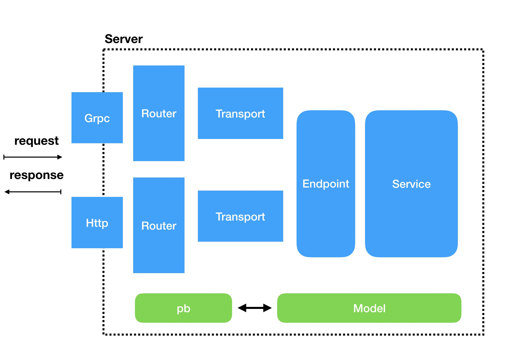

# go-kit demo

基于[go-kit](https://github.com/go-kit/kit)的一个demo工程。

go-kit: A standard library for microservices.


### 目标

* 支持多种协议和数据传输格式
* 开闭原则
* 中间件


### 功能

- [x] pb+grpc
- [x] json+http
- [x] error处理
- [x] 路由


### TODO

- [ ] dao层
- [ ] 容器部署
- [ ] 日志处理
- [ ] 熔断
- [ ] 限流
- [ ] 监控


### 项目逻辑结构





当前demo项目仅提供了 protobuff + grpc 和 json + http两种server。 grpc的请求由grpc的router进行路由，请求体交给transport层进行处理，将pb类型的数据结构转成用户在model层定义的model， 交给service层进行业务处理。 处理结果是model层定义的返回数据， 然后经由transport层转成pb数据用于网络传输。 http的请求也类似，不同的是transport层是进行http协议请求体(响应体)和modle层的转换。


server层负责监听端口，接收请求和返回响应。提供多种server. 如 pb+grpc json+http等。

router层负责路由转发，将transport+endpoint+service组成的handler注册进server。

transport负责数据转化， 将网络协议的请求、响应数据转换成用户自己定义的model

endpoint层提供服务入口，将service层的服务包装，可在endpoint层插入统一的中间件。

service层提供业务逻辑处理， 将model层定义的参数，一系列业务处理后，变成model层的处理结果。


### 项目代码结构

```
.
├── README.md                   
├── cmd                    // 提供client和server的入口
│   ├── client
│   └── server
├── conf                   // 配置相关
├── endpoint               // endpoint层
│   └── user
├── errors                 // 错误处理
├── go.mod
├── go.sum
├── model                  // model层
│   └── user
├── pb                     // pb层
│   └── user
├── router                 // 路由层。grpc和http注册路由的地方
│   ├── grpc
│   └── http
├── server                 // server层，启动服务的地方
│   ├── grpc
│   └── http
├── service                // service层，处理业务逻辑的地方
│   └── user
├── static                 // 文档，文档图片相关
│   └── img
├── transport              // transport, 数据转换的地方
│   ├── grpc
│   └── http
├── util                   // 工具方法
└── vendor                 // 三方依赖

```


